## Отказоустойчивый сайт

Ключевая задача — разработать отказоустойчивую инфраструктуру для сайта, включающую мониторинг, сбор логов и резервное копирование основных данных. Инфраструктура будет размещаться в Yandex Cloud.

С помощью Terraform создаем инфраструктуру: виртуальные машины ( [web-сервера](web_servers.tf), [хост-бастион](bastion.tf), [сборщик логов](elk.tf) и [мониторинг](zabbix.tf) ), [сеть](network.tf), [Application load balancer](balancer.tf), [группы безопасности](security_groups.tf). 

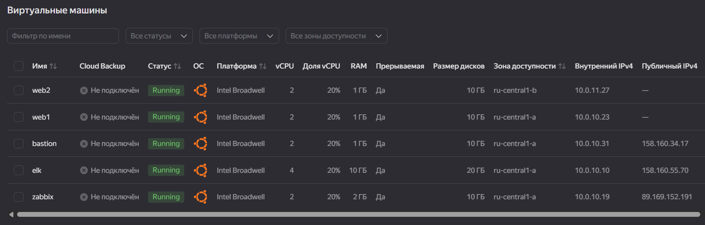

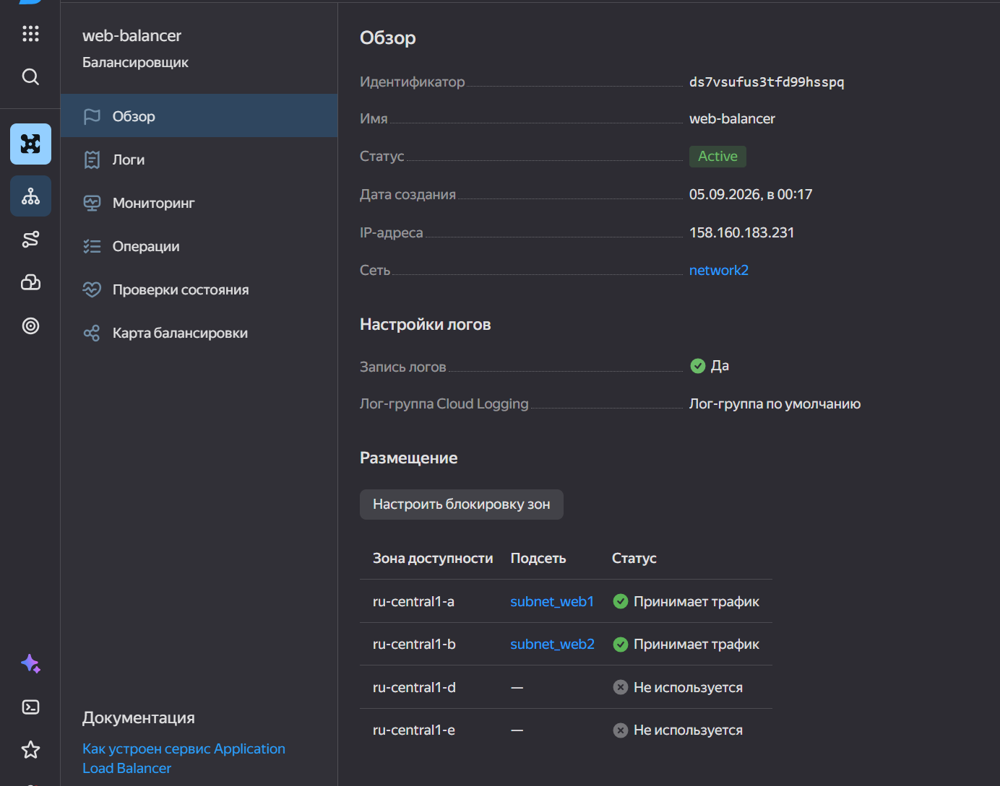

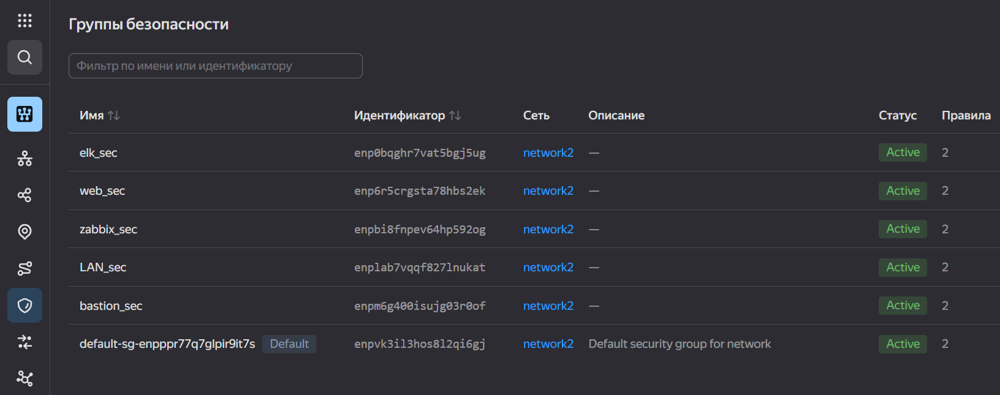

Также настроены [snapshots](snapshots.tf) дисков. Снапшоты выполняются раз в сутки и хранятся 7 дней.

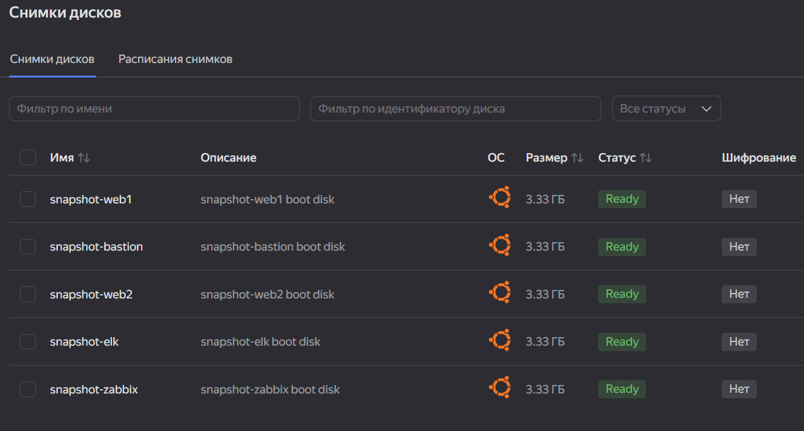

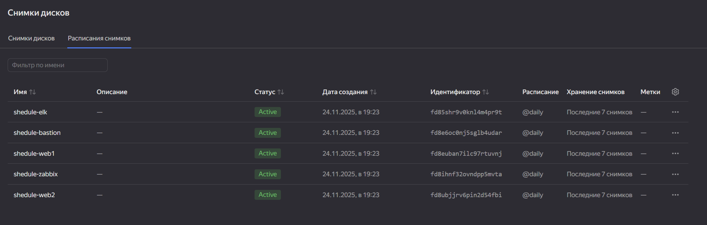

После создания виртуальной инфраструктуры в Terraform с помощью Ansible создается конфигурация необходимых сервисов. Для этого нужно выполнить серию ansible-playbook:
- Playbook [1_Install_MySQL_and_Zabbix_server](./ansible/1_Install_MySQL_and_Zabbix_server.yml) устанавливает zabbix-server с базой данных MySQL. После установки Zabbix нужно перейти в web-консоль и донастроить (первоначальная настройка и добавление хостов в группы).

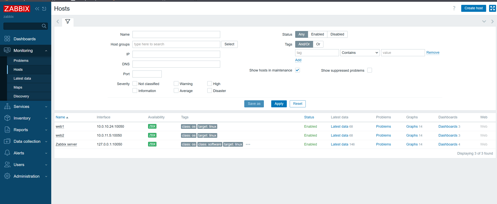

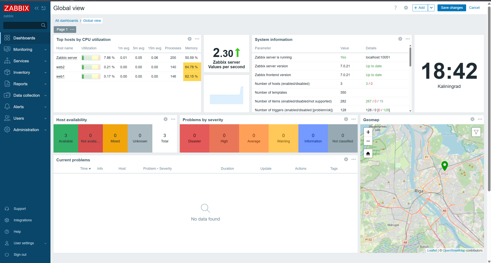

- Playbook [2_install_docker_elk](./ansible/2_install_docker_elk.yml). После установки Zabbix устанавливается Elasticsearch и Kibana. Т.к. доступ к официальному репозиторию закрыт, то устанавливаться эти службы будут из официальных docker-образов. Этот playbook устанавливает docker из официального репозитория, добавляет пользователя alex на удаленной машине в группу docker, скачивает и запускает на удаленной машине файл docker-compose, который устанавливает Elasticsearch и Kibana. В playbook используется модуль pause, который на 90 сек. приостанавливает выполнение, чтобы дать время для запуска Elastic и Kibana, т.к. нужно сбросить пароль пользователя elastic, получить токен и код верификации для подключения Kibana. После того, как playbook отработает, будет указан новый пароль пользователя elastic (его нужно внести в файл переменных var.yml, т.к. он будет нужен для конфигурирования filebeat на web-серверах и аутентификации на сервере elastic). 

- Playbook [3_install_nginx_filebeat_zabbix-agent](./ansible/3_install_nginx_filebeat_zabbix-agent.yml) устанавливает nginx, web-сайт, zabbix-agent и filebeat на web-серверах.

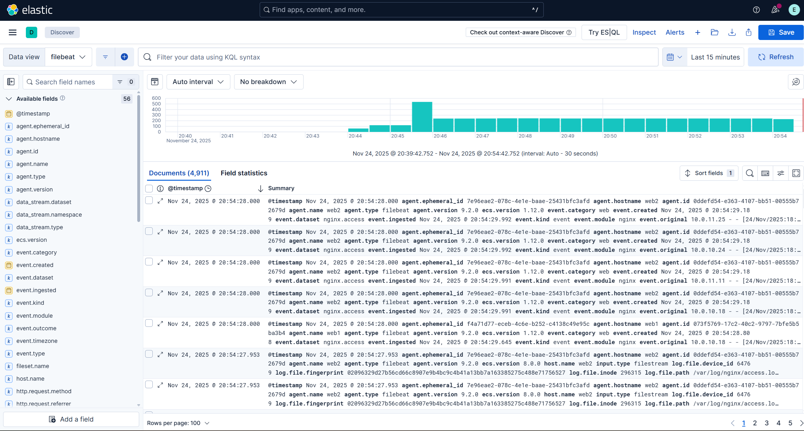

Проверяем как отрабатвыает балансировщик:

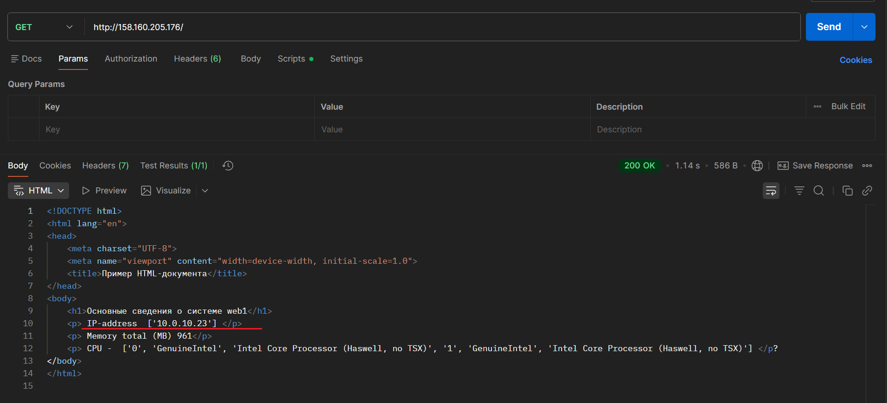

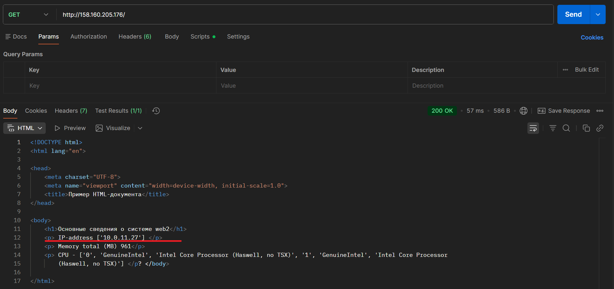

Проверяем доступность из Internet:

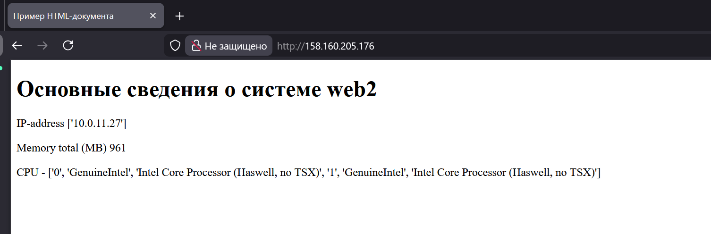
